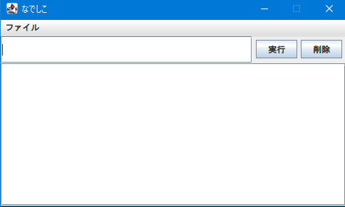
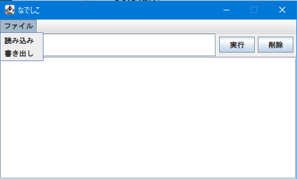
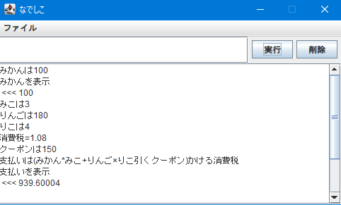
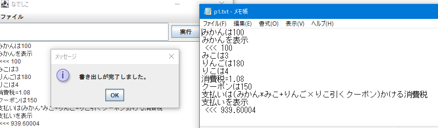

# 電気電子工学実験III(3Q) 報告書
## 実験番号 [Sb] テーマ名 (プログラミングデザイン Program Design)

## 提出者氏名 : 山本晃暉　(学籍番号 : 1894372t)

## 実験実施日 : 2020年10月5日 ~ 2020年11月16日

## 報告書提出期限 : 2020年11月16日
## 報告書提出日 : 2020年11月16日
## 報告書再提出日 : 2020年11月  

  

# 1. 実験の目的
Java 言語の基礎を習得し、GUI などの複雑なライブラリなどを組み合わせたプログラミングの学習を通して、プログラミングの技術に対する理解を深めるとともに、自分でソフトウェアを設計し、デザインする手法を学ぶ。

# 2. 実験内容
実験期間を通して次の演習及び実験を行った。
1. プログラミング練習 : 演習形式の授業を通じて、Javaの基礎について練習する。1,2年度の授業「プログラミング演習I,II」 のように説明と演習を行った。各課題は以下の通り。  
    1. 基礎的な変数・繰り返し文  
    2. If・配列の使い方・算術演算  
    3. String・Charの文字列の扱い・オブジェクト指向1  
    4. デバッグの手法  
    5. オブジェクト指向2
    6. オブジェクト指向3・JTest
    7. GUI1(AWT) 
    8. GUI2(Swing) 
2. 自由課題 : 上記で学んだ内容をもとに、自らソフトウェアを設計し作成する。作成期間はおよそ10日である。
3. 課題発表 : 2で設計した自由課題について英語でのプレゼンテーションを行う。  

なお、実験環境として、以下の環境を用いた。
- Windows 10 Eductation(20H2) + AdoptOpenJDK11(build 11.0.9+11) + Apache Maven(3.6.3)
- Ubuntu 20.04 LTS (on WSL2) + AdoptOpenJDK11(build 11.0.9.1+1) + Apache Maven(3.6.3)  

Windows 10 をメインの開発環境とし、文字コードの関係から Ubuntu はターミナルからの入力確認に用いた。

  

# 3. 自由課題
## 3.1 設計
自由設計において以前から今日ものあったインタプリタ的な機能を持つソフトウェアを設計することにした。授業内で以下の3つの到達点を設定した。
1. (最低限の到達目標) attach function like "print" -> プリント文の機能  
2. (到達できそうな目標) add function of variables    -> 変数機能  
3. (挑戦的な目標) simple calculation           -> 単純な電卓機能

これらの機能を実装した上でさらに、以下の追加機能の実装を行った。

4. インタプリタ部の自動テスト  
5. 簡易エディタ(GUI)  
6. ファイル入出力  

## 3.2 動作
ここから、説明として機能に応じて 1.~4. をロジック部、5.6. をUI部と呼称する。
### UI部の説明  
起動画面は図1のようになる。上部の「ファイル」内にファイルの「読み込み」・「書き出し」メニューが存在する。これらをクリックすることで読み書きができる。(ただし、安全のため読み込みは .txt 形式のみとし、それ以外の形式では、エラーとして処理される)  
プログラムを上部のテキストフィールドに入力し、キーボード上の「Enter」キーもしくは「実行」ボタンを押すことでプログラムが実行される。実行結果は下部のテキストエリアに書き出される。「削除」ボタンを押すことで、実行履歴がクリアされる。  
動作例を図3にて示す。  
図3のようにソフトを実行した後、図2の「書き出し」ボタンを押すことで、図4のように実行結果が保存される。また、出力部の前にプレフィックスとして「 <<< 」という記号がついている。これは出力を表す記号で、「読み込み」からプログラムが実行されたときは無視される、すなわちテキストに適当な実行結果を書いておいて、さも正常に動作したかのように見せることはできない。きちんと処理されているのである。

  
図1 起動時画面  
  
図2 メニューバー展開  
  
図3 実行例  
  
図4 テキスト書き出し  

### ロジック部の説明
先程のUI部のテキストフィールドもしくはロジック部の java ファイルを直接実行したコマンドラインの入力から、テキストを得て、内部的に処理を行い、内容と表示するか否かを表示部 (UIであれば下部テキストエリア・コマンドラインであれば println) に返している。詳細は次項で述べる。

  

## 3.3 詳細な説明
### UI部 (fclass.java)  
一枚の JFrame[mainFrame] 上に JMenubar と JTextField (入力)と JPanel (ボタン2つ搭載)と JTextArea (出力)が乗っている構造になる。
- JMenuBar 
    - 読み込み : openFileDialog にて読み込み元ファイルを指定し、1行ずつロジックに渡す。
        - この時、プレフィックス「 >>> 」がついているものは、過去の出力として無視される。
    - 書き出し : JTextArea の内容を一括取得し、openSaveDialog で指定したテキストファイルに書き込む。
- JTextField
    - プログラムの入力部、エンターキーを押すと実行してくれる機能付き。
- JTextArea
    - 出力が表示される。
    - 出力のみにプレフィックス「 >>> 」が付く。
- JPanel : ボタンを乗せる。
    - 実行ボタン : 押すと JTextFiled の内容を読み込んで、ロジックに渡す。
    - 削除ボタン : 押すと JTextArea の内容を削除する。

### ロジック部(process.java)
現時点で実装している機能は大きく2つ「代入」と「表示」に分けられる。さらに、それらを支えるものとして、変数クラス「nVariable」・演算エンジン「num_process」がある。以下ではそれらについて解説する。また、予約語は表1にまとめられている。  
表1 予約語一覧
| 機能   | 単語      | C言語での記号 |
| :--: | :-----: | :-----: |
| 代入   | は =     | =       |
| 文字列型 | 「」      | ""      |
| 加算   | 足す たす + | +       |
| 減算   | 引く ひく - | -       |
| 乗算   | かける × * | *       |
| 除算   | 割る わる / |/       |  

以下各機能について述べる。
- 代入 : 変数 = 数値
    ― 左辺の変数を右辺の数値(int, float 両対応)に代入する。
    - この時に変数の型(int or float) は保持される。
- 表示 : ~~を表示
    - 表示の前の部分を出力する
    - 内部的に java の System.out.println(); を呼び出している。
- 変数 : nVariable
    - 型判定を行い、変数として値を保存する。
    - int か float か必要に応じて使い分ける。
- 計算 : num_process
    - 与えられた式を解析し、必要に応じて型変換を行いつつ、式が計算可能であると判断すれば、値を返す。
    - 式を予約語の算術演算子や括弧で区切り、各文字を変数か数値か無効な値か判定。
    - 変数と数値・算術演算子の日本語と記号の混在も処理可能である。

## 3.4 テスト入力機能と補足
このソフトのロジック部には JTest による自動テスト機能が備わっている。理由として、毎度ターミナルに日本語コマンドを打つのは不都合だった点に加え、Windows の日本語環境が文字化けを発生させ、その解消方法が見つからなかったためである。実行環境で Ubuntu を使用したのも同等な理由で、ターミナル・内部ともに UTF-8 で動いているから選定した。GUI 作成後は、テキストが正常に処理されるため、開発環境は Windows に戻している。

# 4. あとがき
Java は C++ / Python などとは違い、大規模開発向けのテストや GUI 導入などが行いやすく、それらの言語とは違う独特な魅力を備えていると感じた。ただ、 private/public の概念など、初学者には多少とっつきにくい側面もあると思われる。また、 eclipse/maven などで「プロジェクト」という単位でソフトを管理することに、最初は違和感を覚えた。

  

# 参考文献
1. Kim 先生授業資料  
2. [Let'sプログラミング](https://www.javadrive.jp/tutorial) : https://www.javadrive.jp/tutorial/  
3. 中山清喬/国本大悟スッキリわかる Java 入門 第2版 2016
4. [なでしこ3マニュアル](https://nadesi.com/v3/doc) : https://nadesi.com/v3/doc

# 付録
作成したプログラム : [Github](https://github.com/motty-mio2/Sb-ProgramDesign) : https://github.com/motty-mio2/Sb-ProgramDesign